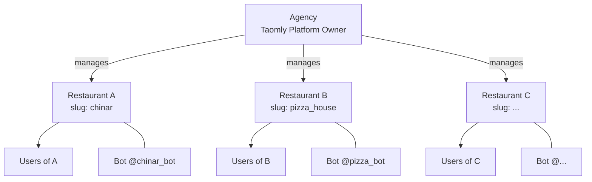
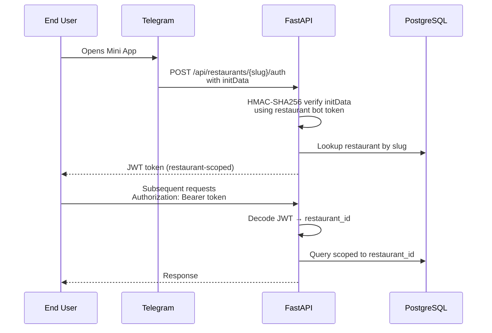
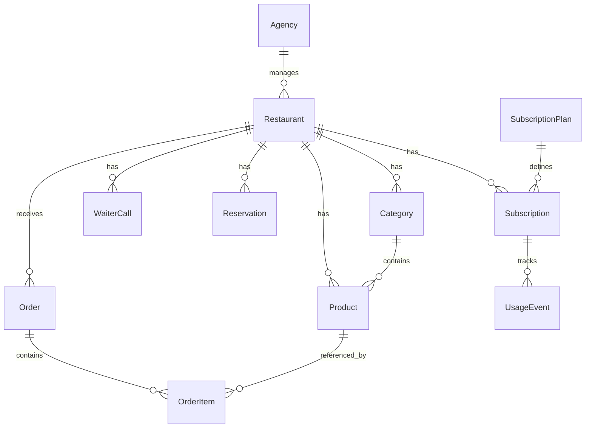

# Taomly — Architecture Diagram

## System Overview

```mermaid
graph TD
    subgraph Clients
        A[Agency Admin<br/>agency_admin.html]
        B[Restaurant Admin<br/>admin.html]
        C[End User<br/>Telegram Mini App / PWA]
    end

    subgraph FastAPI Backend
        API[api.py<br/>CORS · Rate Limiting · Sentry]

        subgraph Routers
            R1[/api/agency]
            R2[/api/restaurants]
            R3[/api/menu]
            R4[/api/orders]
            R5[/api/analytics]
            R6[/api/billing]
            R7[/api/ai]
            R8[/api/reservations]
            R9[/api/waiter-calls]
            R10[/webhook/slug]
        end

        AUTH[auth.py<br/>JWT · Fernet · HMAC-SHA256]
        CONFIG[config.py<br/>Settings · Validation]
        AI[ai_service.py<br/>OpenRouter · OpenAI<br/>Anthropic · Gemini]
        TG[telegram_service.py<br/>Webhook Registration<br/>Order Notifications]
    end

    subgraph Data
        DB[(PostgreSQL<br/>Neon)]
        ALEMBIC[Alembic Migrations]
    end

    subgraph External Services
        BOT[Telegram Bot API<br/>per restaurant]
        SENTRY[Sentry]
        AIPROV[AI Provider<br/>OpenRouter / OpenAI]
    end

    A -->|HTTPS| API
    B -->|HTTPS| API
    C -->|HTTPS| API
    BOT -->|Webhook POST| R10

    API --> AUTH
    API --> CONFIG
    API --> R1 & R2 & R3 & R4 & R5 & R6 & R7 & R8 & R9 & R10

    R1 & R2 & R3 & R4 & R5 & R6 & R7 & R8 & R9 --> DB
    R7 --> AI
    R4 & R10 --> TG
    AI --> AIPROV
    TG --> BOT
    API --> SENTRY
    ALEMBIC --> DB
```

---

## Multi-Tenant Architecture



---

## Authentication Flow



---

## Database Schema (simplified)


